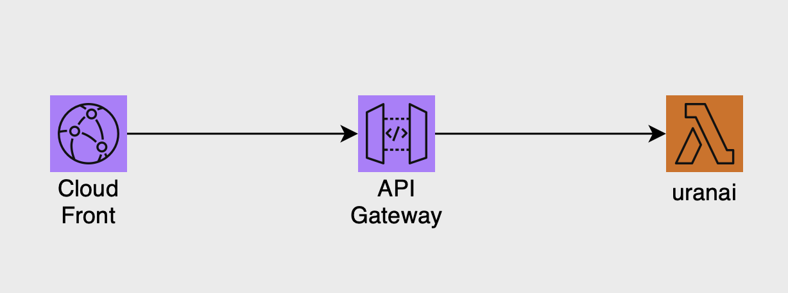

# uranai(妖精占い)

## 使い方

```
import { getUranaiNumber, getFairy } from "./modules/fairy-uranai.mjs";

const number = getUranaiNumber(1976, 4, 26); // year=1976, month=04, day=26
const res = getFairy(number);

console.log(res);
// {"name":"サスケ","info":"いつも素直で正直者のサスケ","good":"不公平なことが大嫌い！ときには自分を犠牲にしてまでみんなと仲良くしようとするよ。純粋な性格が人を惹き付けるので、いろんな人に好かれたり面倒をみてもらえるオトクなタイプかも。夢に向かっていつもやる気満々。苦労が多くても決してあきらめないんだ。もちろん結果もちゃんとついてくるよ。","bad":"ピュアな性格なので、とにかく傷つきやすいんだ。緊張するとまわりが見えなくなって一人で突っ走っちゃうという緊張癖の持ち主。また夢を持ちすぎてしまうので、やりたいことが多すぎて迷ったり、途中で投げ出したりして、熱しやすく冷めやすい性格なんて友達から言われないようにね。","job":"警察官になって、今日も正義を守るために悪と戦っているはず。緊張癖を克服すれば、大勢の乗客の命をあずかるパイロットにも向いていそう。"}
```

## 補足
index.mjs（とfairy-uranai.mjs）をLambdaに登録し、API Gatewayの統合(Integration)に指定すると、REST-APIを作成できます。
